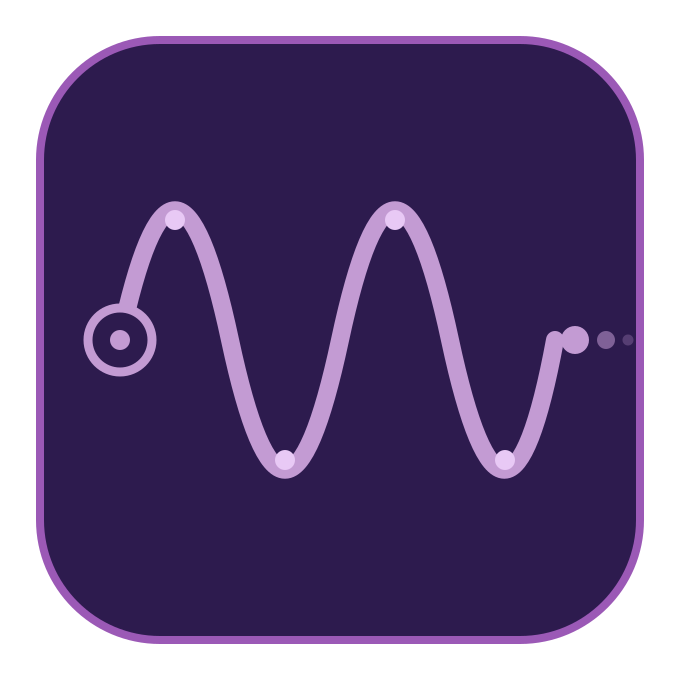

#  [Teledongster](https://teledongster.github.io)

A browser-based tool for capturing motion from a [Teledong](https://teledong.com) device and streaming it in real-time to output devices like [The Handy](https://www.thehandy.com), or recording it as a Funscript file.

## Features

- **Teledong input** via WebUSB with calibration support and sensor diagnostics
- **Manual slider** as a fallback input when no device is connected
- **The Handy** output using HDSP (Handy Direct Streaming Protocol) for low-latency direct streaming
- **Funscript recording** with configurable filtering and peak motion detection
- **Real-time motion graph** showing input and output waveforms
- **Handy diagnostic tools** for latency, accuracy, and overshoot analysis
- **Persistent settings** saved to localStorage

## Requirements

- **Chromium-based browser** (Chrome, Edge, Opera) for WebUSB support
- **HTTPS** required for WebUSB access (localhost is exempt)
- Node.js and pnpm for development

## Getting Started

```bash
pnpm install

# Development (localhost only)
pnpm dev

# Development with HTTPS + network access (for testing on other devices)
pnpm dev:network

# Production build
pnpm build
```

## Scripts

| Command | Description |
|---------|-------------|
| `pnpm dev` | Start dev server (localhost) |
| `pnpm dev:network` | Start dev server with HTTPS, accessible from network |
| `pnpm build` | Type-check and build for production |
| `pnpm preview` | Preview production build |
| `pnpm test` | Run tests |
| `pnpm lint` | Run oxlint |
| `pnpm format` | Format code with oxfmt |
| `pnpm format:check` | Check formatting without writing |

## Development Tips

When working with The Handy, the browser sends CORS preflight (OPTIONS) requests for every API call. With DevTools open and caching disabled, these requests are not cached and can pile up quickly. To keep things smooth, make sure "Disable cache" is unchecked in the Network tab while testing Handy connectivity.

## Tech Stack

- Vue 3 (Composition API)
- TypeScript
- Vite 8

## Acknowledgements

This project is based on the Teledong Web SDK and the Teledong Commander application from the [teledong](https://github.com/iwakan/teledong) repository.
